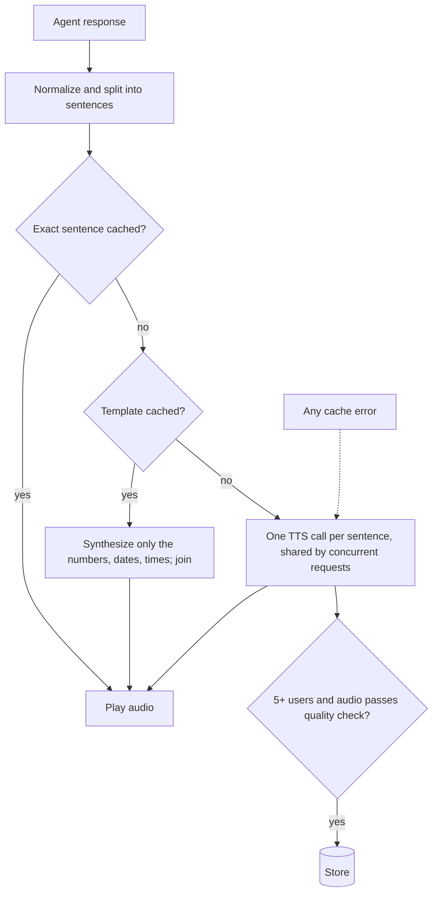
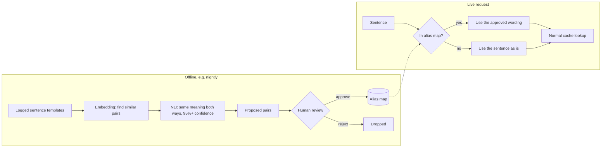

# TTS Response Caching: Architecture and Approach

## Summary

In a voice assistant, the same agent responses come up again and again across users, but every one of them is sent to the TTS API and billed per character. This project puts a cache between the agent's text and the TTS call.

The rule I designed around: **we can trade off efficiency, but never correctness.** Playing audio for words the agent didn't say is a bug. Paying for a TTS call is only a cost. So every part of the cache falls back to normal synthesis when it isn't sure.

Results on about 13,000 synthetic requests in English, Hindi and Kannada, with deliberately varied phrasing, and the admission threshold at 5 users:

| Strategy | TTS characters saved |
|---|---|
| Standard audio caching (exact match on the whole response) | 9.1% |
| Segment-level caching (per sentence) | 49.4% |
| Template caching (numbers, dates and times as slots) | 66.3% |
| Semantic template caching | 66.5% (+0.2, with 37 wrong matches) |

Segment-level caching saves more than 5× what standard caching does, and template caching adds another 17 points on top. Semantic caching barely helps and sometimes plays the wrong sentence, so I don't recommend running it live. It's better used offline to build a human-reviewed alias map.

## Assumptions

- The TTS provider is assumed to be ElevenLabs, but the design doesn't depend on it. TTS sits behind one interface, and the PoC uses a stub.
- The agent's text is fixed input. The cache can't change the wording or ask the agent to mark which parts are variables, so variables have to be detected.
- "Standard audio caching" here means an exact match on the whole response text. Everything is compared against that.
- Not built: streaming (the design fits it, since lookups happen per sentence), a real provider integration, and caching before the LLM.

## What counts as a repeat

**A repeat is the same spoken content, sent to TTS with the same parameters (language, voice, model, settings, output format), in the same cache namespace.** "Same content" is decided after safe normalization (see Cache key design).

**A repeat is worth caching once at least 5 different users have heard it within the last 7 days.**

- **Different users, not a raw count.** A sentence one user hears many times is usually personal ("Your balance is ₹45,230"). Counting distinct users keeps those out of a shared cache and stops one caller or bot from forcing entries in. A raw count would save a little more, but it would admit exactly those sentences.
- **One 7-day window.** Seven days covers weekly patterns, so steady but low-volume sentences still qualify, and it keeps the counter's memory bounded. Bursts don't need their own window, because admission is checked on every request: a sentence five users hear in the first minute of an outage gets cached in that minute. I first planned a separate one-hour window for bursts, then realised it was redundant with the same threshold.
- **The threshold has a price.** At a threshold of 1, template caching saves 83.5%; at 5 it saves 66.3%. That gap is the cost of the privacy gate. It's overstated on a dataset this size, since each sentence only pays for its first few misses once, which matters far less at millions of requests.
- The counter itself stores only HMAC hashes of the cache key and the user ID, never the text.

## How a request flows

Each sentence tries the cheapest correct option first. Only a sentence that misses everything is synthesized, and it's stored only once enough people have heard it.

## Caching techniques

### 1. Segment-level caching

Instead of caching whole responses, I cache each sentence. Agent responses are built from parts (a greeting, a body, a closing), and whole responses rarely repeat exactly, but their sentences do.

This is the biggest single win: **49.4% vs 9.1%** on the same traffic. The two strategies differ only in how text is split into cache units, so the comparison is fair. It also fits streaming, where TTS already receives text one sentence at a time.

Tradeoff: the voice resets a little at each sentence, and an old cached sentence can sound slightly different next to a newly synthesized one. Joins fall on natural pauses, which helps.

### 2. Template caching

"Your order 4521 has been shipped" never repeats exactly, because the number changes. Template caching turns it into "Your order {NUM} has been shipped", caches the fixed words once, and only synthesizes the number each time.

- Slots are numbers, numeric dates and times. Currency becomes a number during normalization.
- At most two slots per sentence. More than that means too many joins.
- The fixed parts are cut out of the first full synthesis using word timestamps, so there are no extra TTS calls, and the words were spoken in context.
- If the exact sentence (number included) is already cached, that single clean clip is used instead.

Result: **66.3%**, 16.9 points above segment-level caching, with fewer TTS calls (10,481 vs 10,969).

Tradeoff: every template hit has joins in the middle of a sentence. The stub can't tell me how that sounds, and some languages attach suffixes directly to numbers. So template caching should be switched on per language after a listening test. That switch is designed but not built.

### 3. Admission policy

Covered above: 5 distinct users in 7 days, plus a quality check before storing (the audio must not be empty and its length must be plausible for the text). This keeps the cache small and mostly free of personal data.

### 4. Request coalescing

If thousands of calls hit the same new sentence at once (say, an outage announcement), only the first request calls TTS and the rest wait for its result. If that call is slow or gets cancelled, the waiters stop waiting and synthesize for themselves after a short timeout. In tests, 50 simultaneous misses made one TTS call.

### 5. Semantic template caching (built and tested, not recommended live)

The idea: if nothing is cached for "We have shipped your order 7788", play the cached "Your order {NUM} has been shipped" with 7788 in the slot. An embedding model finds the closest cached sentence, and a multilingual NLI model has to agree, with at least 95% confidence in both directions, that the two mean the same thing.

What I found:
- **Similarity alone isn't safe.** "Money was transferred to your account" and "…from your account" score 0.987, higher than most real paraphrases.
- On 416 hand-labeled pairs in English, Hindi and Hinglish, the NLI gate made **0 wrong matches** at 95% confidence and caught a third of the true paraphrases.
- On the traffic it added only **0.2 points**. It made 989 semantic hits from 16 distinct pairs, and 2 of those pairs were wrong, **37 wrong answers** in total. A Hindi "your order has been delivered" was played as "your order has been shipped", and "it should reach you on {date}" as "you should receive it by {date}".
- The gain is small because the paraphrases were common enough to get cached on their own anyway. Gain would rise with higher variance in content of similar meaning that's only seen by a couple users.
- Kannada, which the NLI model wasn't trained on, produced no semantic matches at all.

So I'd use the same models **offline**: they propose paraphrase pairs, a person approves them, and the live system does a plain lookup. Reviewing 16 pairs takes a few minutes; a reviewer would approve the 14 good ones and reject the 2 bad ones quickly. The review effort grows with the number of distinct pairs, not with traffic. That gets the savings with no wrong answers and no added latency.

Proposed rollout:

In the test traffic this would have meant reviewing 16 pairs: approving 14 and rejecting the two that caused all 37 wrong answers.

## Cache key design

The key is a SHA-256 hash of the exact text sent to TTS plus language, voice, model, settings, output format and namespace. The key and the TTS call are built from the same inputs, so they can't disagree.

**Language is always part of the key**, even when the text is identical: "नमस्ते" in Hindi and in Marathi get separate entries, because they may be pronounced differently.

Before hashing, I only normalize things that can't change how the sentence sounds:
- Unicode normalization (the same Devanagari letter can be stored two ways) and extra spaces.
- Per-language rules that make `₹500`, `Rs. 500` and `रु 500` the same.
- I deliberately don't lowercase ("US" and "us" are said differently) or strip punctuation ("." and "!" are said differently).

## Storage

| Where | What | Why |
|---|---|---|
| Memory on each server | The ~500 most-used clips (LRU) | Instant playback for the greetings and closings that dominate traffic |
| Object storage (S3 in production) | Every cached clip, with its metadata | Cheap and effectively unlimited |
| Redis in production | Admission counters | Small, read on every request, supports expiry |

Audio is stored as raw PCM next to a small JSON file with the sample rate, word timestamps and creation time. The metadata is written last, so a half-written entry is never served. The PoC uses in-memory and local-file stand-ins behind the same interfaces.

## Invalidation

Stale audio is mostly prevented by the key rather than cleaned up afterwards:

- **Content changes** (new prices, new hours) produce different text, so a different key. The old audio is simply never matched again.
- **Voice, model or settings changes** are part of the key, so they work the same way.
- **Pronunciation fixes** change the text or settings sent to TTS, so they also change the key.
- **Everything expires 30 days after it was written**, even popular clips. That catches problems the key can't see, like a slightly wrong clip or a silent provider update.
- **Bad audio** (empty or cut off) is rejected before it's stored, so one bad clip can't be replayed thousands of times.
- For emergencies, a single key can be purged by hand.

## Multilingual support

There's one codebase for every language. What differs per language lives in a small JSON rules file: which characters end a sentence (`.`, `?`, `।`), abbreviations like "Dr." or "डॉ.", and currency spellings. Adding a language means adding a file, not code.

A language without a rules file still works; it just matches a bit less. Kannada was included in the test traffic with no rules file at all and went through the same pipeline. So rules can be added one language at a time, starting with the highest-traffic ones.

## Cost measurement

TTS is billed per character, so the metric is **characters saved ÷ characters requested**. That number is the cost reduction.

A plain hit rate overstates it, because the sentences that hit most are the short ones (greetings, "Okay."). So the relationship is roughly: cost reduction = hit rate weighted by sentence length.

The real saving is that minus what the cache costs to run (storage, lookups, counters). In production I'd prove it by reconciling the provider bill against logged misses, comparing cost per conversation before and after, and keeping 1–5% of traffic uncached as a control group.

## Monitoring

**What's built:** every sentence records one outcome (hit, stored, below threshold, rejected by the quality check, or semantic hit) along with its character count, and the harness reports these per strategy. The semantic strategy also logs every "played X in place of Y" decision so a person can review them. That log, graded against the dataset's meaning labels, is how the 37 wrong matches above were found.

**What I'd add in production** (not built): the same outcomes as metrics per language and namespace, extra miss reasons (expired, evicted, storage error), and alerts when storage errors rise, savings drop or quality rejections spike. Knowing *why* things miss is what makes a drop diagnosable: a model upgrade shows up as a wave of misses on sentences that used to hit, while a prompt change shows up as lots of new sentences below the threshold.

## Fallback

The cache must never block or break a voice response:

- If storage fails, it counts as a miss and the sentence is synthesized.
- Any other error in the cache path falls back to synthesizing the agent's original text.
- If the TTS provider itself fails, the error is passed on rather than hidden, and waiting requests don't all retry against a failing provider.
- If a user interrupts, the synthesis is cancelled and nothing incomplete is stored.

## Alternatives I considered

| Option | Why not |
|---|---|
| Live semantic caching | Wrong matches on real-looking traffic for a tiny gain (see above) |
| Similarity alone, without an NLI check | Opposite meanings can score higher than paraphrases |
| Lowercasing and stripping punctuation before hashing | Changes how the sentence is spoken |
| Counting raw requests instead of distinct users | Caches personal, single-user sentences |
| Semantic caching before the LLM | A different problem (caching answers to questions) |
| Pre-synthesizing predicted replies | Saves latency but increases spend |

## Limitations

- All traffic is synthetic, so the percentages depend on how the data was generated.
- The stub TTS can't measure audio quality (template joins) or real latency.
- Not built: the per-language template switch, the alias map, and production monitoring.

## How I built this

I worked through the design with an AI assistant, wrote a spec first (`spec.md`), and built it module by module with tests from the spec's acceptance criteria. The language rules, synthetic datasets, labeled test pairs and a first draft of this document were AI-assisted and then reviewed and edited by me.