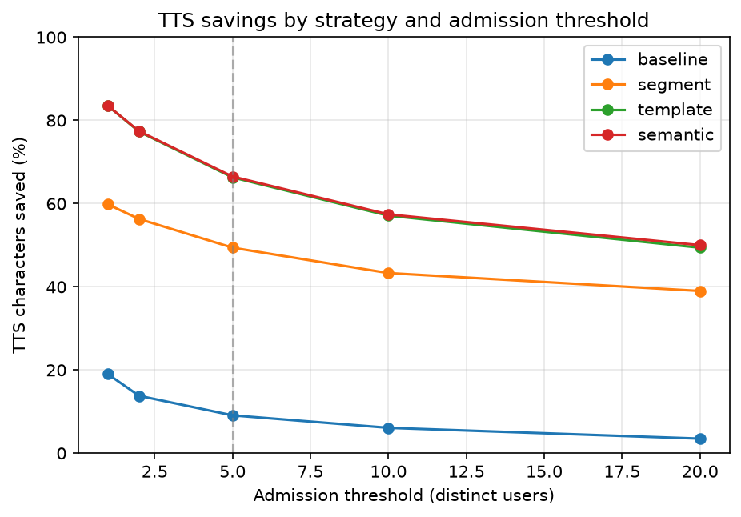

# TTS Response Caching

A caching layer between a voice agent's text output and the text-to-speech (TTS) call. Sentences that repeat across
users are played from cache instead of being synthesized and billed again. This is a proof of concept of the caching
logic, with a stubbed TTS and a harness that compares strategies on the same multilingual traffic.

**Start with [`ARCHITECTURE.md`](ARCHITECTURE.md)**: the design, the reasoning behind it, and the findings.
[`spec.md`](spec.md) has the spec and acceptance criteria.

## Results

13,000 synthetic requests in English, Hindi and Kannada; a sentence is cached once 5 distinct users have heard it.

| Strategy | TTS characters saved |
|---|---:|
| Standard audio caching (exact match on the whole response) | 9.1% |
| **Segment-level caching** (per sentence) | **49.4%** |
| **Template caching** (numbers, dates and times as slots) | **66.3%** |
| Semantic template caching (embedding + NLI gate) | 66.5%, with 37 wrong matches |

Template caching is the recommended setup. Semantic caching adds 0.2 points but sometimes plays the wrong sentence,
so it is built and measured but not recommended live ([why](ARCHITECTURE.md#5-semantic-template-caching-built-and-tested-not-recommended-live)).



## Quick start

Python 3.10+ (developed on 3.12). No external services: storage uses in-memory and local-file stand-ins for
Redis/S3, and TTS is a stub.

```bash
python3 -m venv .venv
source .venv/bin/activate            # Windows: .venv\Scripts\activate
pip install -r requirements.txt      # pytest, pytest-asyncio, matplotlib

python -m pytest                     # 86 tests, a few seconds, no models needed
python -m harness.compare            # all strategies × thresholds 1, 2, 5, 10, 20
```

The harness prints the tables and writes `results/results.json` and the chart. It skips the semantic strategy unless
its models are installed.

### Optional: semantic caching

```bash
pip install -r requirements-semantic.txt     # torch, sentence-transformers, transformers (~1–1.5 GB on first use)
python -m harness.compare                    # now includes semantic; about 4 min on an Apple GPU, longer on CPU only
python -m experiments.semantic_eval          # grades the matcher on 416 hand-labeled pairs
```

The harness grades each semantic match against the dataset's meaning labels and prints every "played X in place of
Y" decision, marked `ok` or `WRONG`.

## The dataset

`data/traffic.jsonl` is the exact traffic behind the results. It has 13,000 requests:
- 5,000 base requests with a few fixed wordings per reply.
- 8,000 high-variance requests. These include several phrasings per intent and near-misses side by side (shipped /
  delivered, on / by a date). They also have realistic values (alphanumeric order IDs, ₹ / Rs. / INR amounts,
  written dates), customer names and free-form sentences.
- About 64% English, 32% Hindi (including some Hinglish), and 4% Kannada. Kannada has no language rules file, to
  show that an unconfigured language still works.
- Every sentence carries a meaning label.

Regenerate it with `python -m harness.generate_dataset` (fixed seeds, same output).

## Repository layout

```
tts_cache/             the library
  strategies/          baseline, segment, template, semantic
  lang/                per-language rules (en, hi); other languages fall back to defaults
  tts/                 TTS interface + stub
  normalize.py, splitter.py, keys.py, counter.py, storage.py,
  coalescing.py, quality.py, metrics.py, semantic.py, pipeline.py
harness/               dataset generation (generate_dataset.py, varied_traffic.py) and compare.py
experiments/           semantic matcher evaluation and labeled pairs
data/, results/        the traffic and the harness output
tests/
```

## Limitations

- All traffic is synthetic, so the percentages depend on how it was generated.
- The stub TTS returns evenly spaced words with no pauses or prosody, so template joins are flawless here.
  Real audio needs a listening test. Template slicing also assumes one word timestamp per written word.
- The Hindi and Kannada dataset sentences were written with AI assistance; a native-speaker review would strengthen them.
- Designed but not built: the reviewed alias map for semantic matches, the per-language template switch, production
  monitoring, and streaming integration.

## How this was built

I designed it with an AI assistant, wrote the spec before the code, and built it module by module with tests from
the spec's acceptance criteria. The language rules, datasets, labeled pairs and first documentation drafts were
AI-assisted and then reviewed and edited by me.
